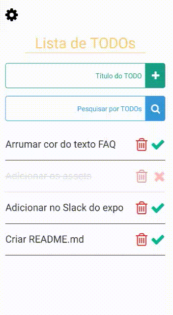
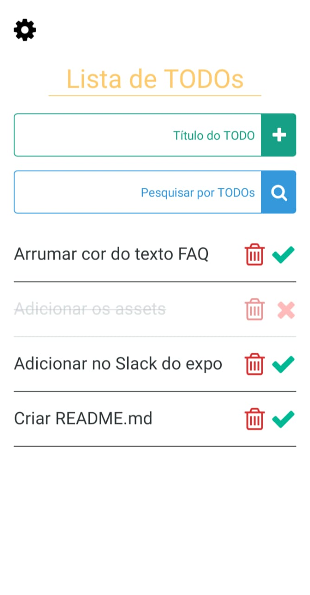
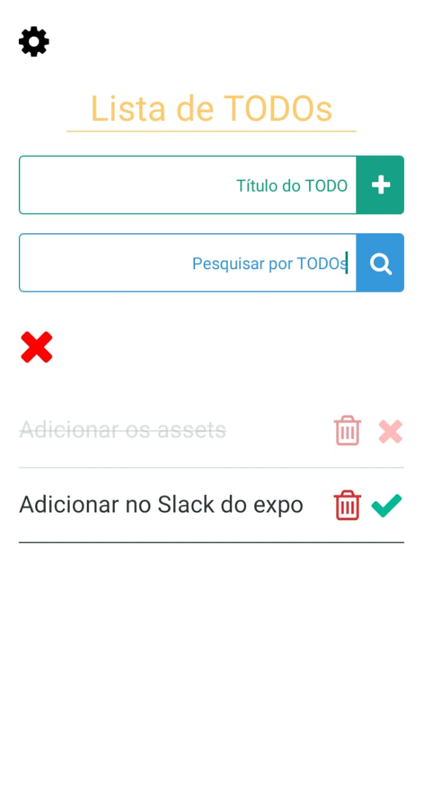
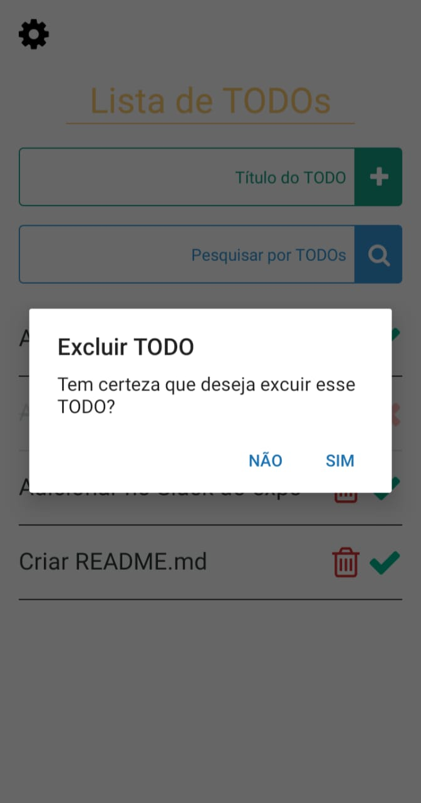
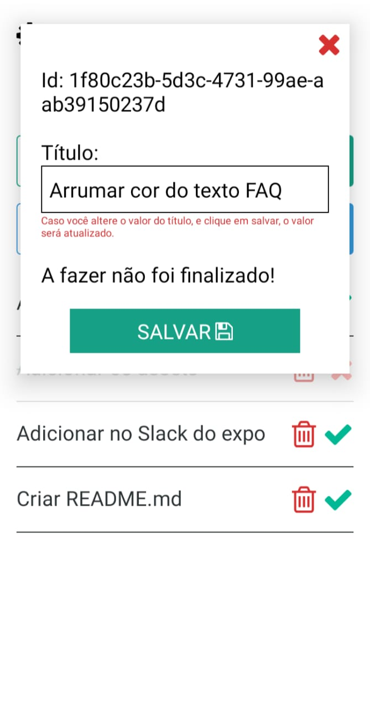
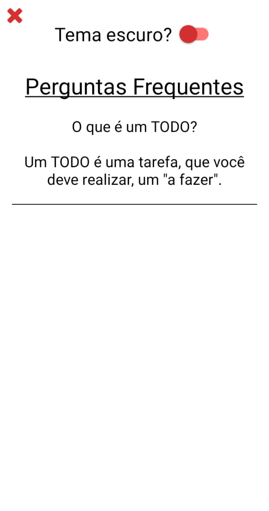

<h1 align="center">SkyTODOs</h1>

  Aplicativo simples de TODO criado com React Native e Expo.

  

## Tecnologias usadas :rocket:

- [Expo](https://expo.dev/)
- [React](https://pt-br.reactjs.org/)
- [React Native](https://reactnative.dev/)
- [React Native Vector Icons](https://oblador.github.io/react-native-vector-icons/)
- [React Native Toast](https://github.com/magicismight/react-native-root-toast)

## Funcionalidades :video_game:

- Criar TODOs.
- Filtrar TODOs.
- Remover TODOs.
- Atualizar TODOs.
- Finalizar TODOs.
- Temas(claro ou escuro)

## Imagens :sparkles:

## Instalar/Executar :hammer:

1. Baixe o repositório em seu computador.
2. Navegue até a pasta do projeto.
3. Instale as dependências com `npm install` ou `yarn`.
4. Execute o expo com `npm start` ou `yarn start`.

## Observação :warning:

O Aplicativo não foi testado na plataforma iOS, caso queira testar e contribuir(achar bugs, arrumar estilos, etc) com o projeto, por favor abra um PR.
